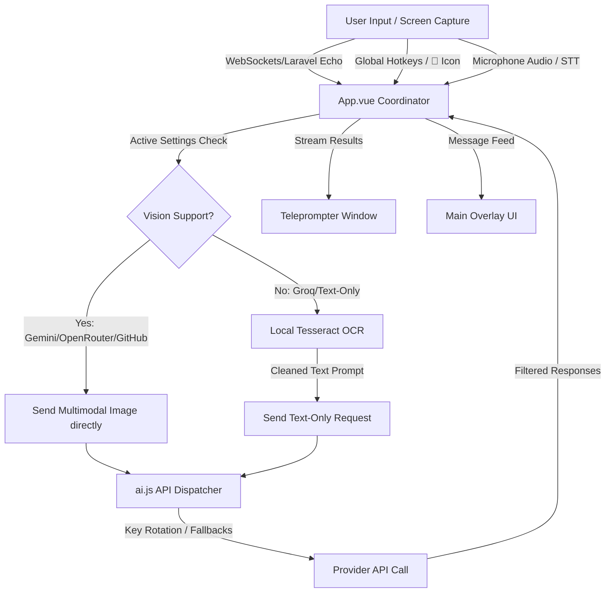

# GHOST COACH: PROJECT CONTEXT & ARCHITECTURE DOCUMENTATION

This document provides a comprehensive technical overview of the **Ghost Coach** codebase, features, architecture, and developer patterns. It is designed to give any AI assistant or developer full, immediate context on how the application works, its internal mechanics, and its implementation guidelines.

---

## 📖 1. System Overview & Core Workflow

**Ghost Coach** is a premium, real-time interview helper and developer copilot desktop application built on **Electron + Vue 3 (Vite) + Vanilla CSS**. It operates as a floating glassmorphic overlay that runs on top of other windows (e.g. Zoom, browsers, coding windows).



---

## 🛠️ 2. Key Capabilities & Feature Breakdown

### 📡 Real-Time WebSocket Listener (Laravel Echo & Reverb)
* Connects dynamically to a Laravel Echo / Reverb server configured in Settings.
* Listens on a designated public channel/event for incoming broadcast payloads (e.g. questions transmitted live by an interviewer or external web tool).
* Automatically displays incoming questions in the feed and (if enabled) pushes them to the auto-run teleprompter.

### 📸 Multimodal Screen Area Capture (Crop Overlay)
* **Trigger:** Click the `📸` button in the header toolbar.
* **Process:**
  1. Hides the main Ghost Coach and teleprompter windows temporarily.
  2. Captures the primary screen display using Electron's `desktopCapturer`.
  3. Resizes the main window bounds to fill the entire primary screen.
  4. Renders the screenshot in a full-screen semi-transparent mask crop overlay inside the Vue app.
  5. The user clicks and drags to draw a dashed crop selection rectangle (showing live dimensions).
  6. On mouse release, the crop is drawn onto an offscreen canvas (scaling perfectly to handle High-DPI/Retina screens).
  7. Restores the window size back to its original floating bounds.
  8. Forwards the cropped Base64 image to the active AI provider.
  * **Cancellation:** Pressing the `ESC` key instantly cancels crop mode and restores the window layout.

### 🧠 Intelligent AI Routing & Fallback Local OCR
* If the active provider natively supports vision (`gemini`, `openrouter`, or `github`), the raw Base64 screenshot is sent directly.
* If the active provider is text-only (like `groq`), the app runs a local WebAssembly-based **Tesseract OCR engine** first to extract characters. The extracted text is cleaned of noise and passed as a text query.

### 🎤 Voice Capture & STT Copilot
* Leverages standard Web Audio API microphone capture.
* Supports transcription through three modes:
  * **Toggle Mic:** Transcribes voice input and places it in the chat box for manual review.
  * **Auto-Send Mic:** Transcribes and automatically submits the question to the AI.
  * **Interim Checkpoint Recording:** Allows recording continuous chunks (checkpoints) to capture longer descriptions without hitting API timeouts.

### 🗣️ Scroll-Synced Teleprompter Overlay
* Launches a separate borderless, translucent, scrollable teleprompter window.
* Renders the AI response in a large, readable format suitable for reading live.
* Tracks read progress and mirrors highlights back to the main overlay window in real time.

### ❓ Questions Database (Portfolio Showcase)
* A dedicated overlay panel containing a catalog of 12 CodeBrisk Product Story projects and a generalized "Challenge" question card.
* **Search:** A search bar filters questions by title or description in real-time.
* **Accordions:** Built as expandable accordion items (Question -> click -> expands Description) with responsive font-size adjustments (`A+` / `A-` header controls dynamically scale the Questions text).
* **Remote Sync:** Synergizes with a remote Laravel backend by hitting `GET /api/questions`, caching answers to `localStorage`, and falling back to `/api/profile` scraping if the dedicated questions endpoint is missing.

---

## 🔑 3. Key Rotation & API Error Handling

In [src/services/ai.js](file:///Users/muhammad/Personal/Projects/Personal%20Projects/GhostCoach/src/services/ai.js), keys are rotated dynamically to ensure uninterrupted usage:
* **Storage:** API keys can be entered as single strings or comma-separated lists (internally parsed into key arrays).
* **Rotation Logic:**
  * If a request fails with an HTTP `401` (Unauthorized), `403` (Forbidden), or `429` (Rate Limit Exceeded), the service logs the error, automatically rotates to the next available API key in the list, and retries the request.
  * For general transient upstream server errors (e.g. 500 status, empty response bodies), the app retries the *same* key once before rotating to the next.
  * If all keys fail, the app throws the cumulative error payload to the user interface.

---

## ⚖️ 4. Token Limits & TPM Optimization Rules

To prevent **Tokens Per Minute (TPM)** limits from causing request failures (critical on models like `openai/gpt-oss-120b` which have low 8,000 TPM ceilings):

1. **OCR Output Cleanup:** In [src/services/ocr.js](file:///Users/muhammad/Personal/Projects/Personal%20Projects/GhostCoach/src/services/ocr.js), raw OCR text is sanitized to compress whitespaces:
   ```javascript
   return rawText
     .replace(/[ \t]+/g, ' ')  // Merge multiple spaces/tabs
     .replace(/\n{3,}/g, '\n\n') // Limit consecutive newlines to maximum of 2
     .trim();
   ```
2. **Trimmed History Context:** History array parameters sent to `sendChatMessage` are sliced to include only the last **6 messages (3 user + 3 assistant turns)**. This keeps the prompt size low and prevents history from diluting system prompt instructions.
3. **Reduced Output Reservation (`max_tokens`):**
   * Since APIs calculate rate-limit usage as `Input Tokens + max_tokens`, high reservations block subsequent requests.
   * `max_tokens` is limited to **`2048`** for Groq, OpenRouter, and GitHub Models, saving 2,048 tokens on the reservation threshold per call while maintaining detailed output.

---

## 🛡️ 5. Mitigation of Gemini Recitation Safety Blocks

Gemini has built-in safety filters that halt generation with `FINISH_REASON_RECITATION` if output closely mimics common LeetCode snippets or training text.
* **Prompt Instructions:** Prompts injected into `App.vue` force Gemini to:
  * Use **unique, non-standard variable and function names**.
  * Use **custom logical flows and structures** instead of standard textbook solutions.
  * Add **interspersed explanatory comments**.
* **API Logic:** In [src/services/ai.js](file:///Users/muhammad/Personal/Projects/Personal%20Projects/GhostCoach/src/services/ai.js), we check candidates for `finishReason === 'RECITATION'` and throw a descriptive warning pointing out the safety block.

---

## 📂 6. Codebase Architecture

```
GhostCoach/
├── package.json              # App dependencies, Vite commands, build scripts
├── electron/
│   ├── main.js               # Electron main process (IPC handlers, Capturer, window management)
│   └── preload.js            # Secure Electron-to-Vue IPC bridge definitions
├── src/
│   ├── main.js               # Vue application entry point
│   ├── App.vue               # Main coordinator (Overlay state, Hotkeys, prompt builders)
│   ├── style.css             # Glassmorphism, animations, global styling definitions
│   ├── data/
│   │   └── defaultQuestions.js  # Static interview questions dataset
│   ├── services/
│   │   ├── ai.js             # Gemini, Groq, OpenRouter, and GitHub Models handlers (key rotation, retries)
│   │   ├── ocr.js            # Tesseract OCR WebAssembly engine
│   │   ├── voice.js          # Speech-to-Text navigator wrapper
│   │   ├── fileParser.js     # Client-side PDF/TXT resume parser
│   │   └── profileSync.js    # Laravel API `/api/profile` & `/api/questions` synchronizer
│   └── components/
│       ├── AppHeader.vue      # Top dragbar, status indicator, toolbar controls (A-, A+, 📸, ❓, Config, etc.)
│       ├── MessageFeed.vue    # Container for rendering user/assistant message lists
│       ├── MessageCard.vue    # Individual bubble cards with copy, delete, and scroll features
│       ├── ChatInput.vue      # Search/Input bar with voice mic toggles
│       ├── SettingsOverlay.vue # Multi-tab configuration panel (Websockets, AI, Candidate, Appearance, Shortcuts)
│       ├── KeyboardShortcuts.vue # Dedicated shortcuts page listing global keys in clear <kbd> layout
│       ├── QuestionsOverlay.vue # Accordion database for project showcase and remote Laravel sync
│       └── Teleprompter.vue   # Separate transparent teleprompter overlay component
```

---

## 🧪 7. Development, Testing & Verification Commands

### Development Server
Launches the Vite server and Electron simultaneously in hot-reload mode:
```bash
npm run dev
```

### Run Unit Tests
Verifies the complete front-end suite (including component mounts, props, events, and API mocks):
```bash
npx vitest run
```

### Production Package Compilation (macOS)
Builds production assets and packages the app, then automatically registers a local code signature (which is required by macOS Sequoia to prevent Screen Capture permission loops):
```bash
npm run build:mac
```

---

## ⚠️ 8. Crucial Rules for AI Subagents & Coding Assistants

When editing this codebase:
1. **Maintain Context Isolation:** Do not add large static data objects inside `App.vue` or component files. Static files belong in `src/data/` or independent modules.
2. **Preserve Code Quality:** Keep styles in `src/style.css` rather than ad-hoc inline styling, unless dynamic user settings (like colors/opacities) require inline Vue bindings.
3. **Retain Unit Tests:** If updating button orders, emits, or key fields, always check and adjust files under `src/components/__tests__/` and `src/services/__tests__/` accordingly. Do not leave broken tests behind.
4. **Follow TCC Permission Rules:** Never call native macOS APIs directly without handling potential empty permissions (e.g. `desktopCapturer.getSources` returning empty arrays). Handle capture exceptions gracefully and lead users to System Settings to enable permissions.
